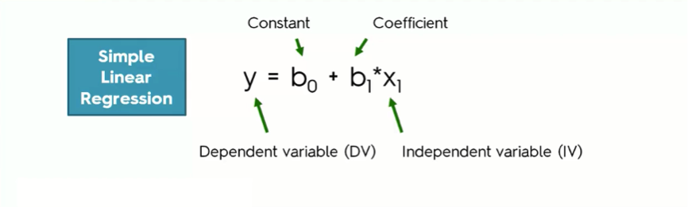
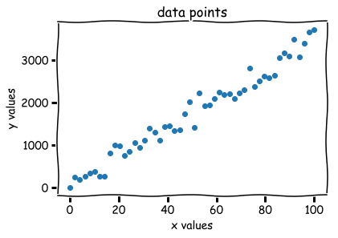
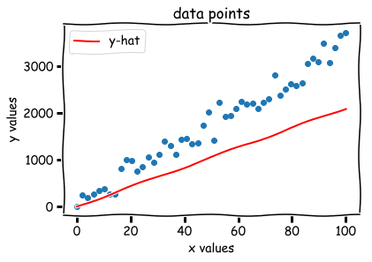
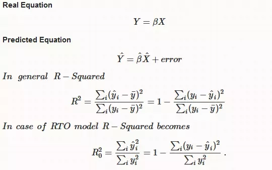
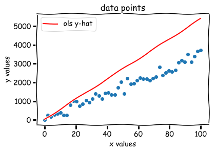
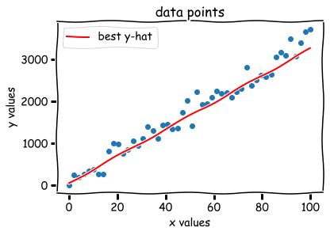

### Questions

### Objectives
YWBAT
* define linear regression
* create an example of linear regression
* describe what the various parts of the linreg equation do
* calculate the error of a linear regression equation

### What is linear regression?



### When do we use it?

### Let's make an example with some data!!!!!


```python
import numpy as np
import matplotlib.pyplot as plt
import seaborn as sns
plt.xkcd()
```


    <contextlib._GeneratorContextManager at 0x1c20065e80>


```python
x_vals = np.linspace(0, 100, 50)
```


```python
slope = np.random.randint(20, 50)
errors = np.random.normal(100, 200, 50)
bias = np.random.randint(20, 200)
```


```python
y_vals = slope*x_vals + bias + errors
```


```python
plt.scatter(x_vals, y_vals)
plt.xlabel("x values")
plt.ylabel("y values")
plt.title("data points")
plt.show()
```





### Let's check the correlation coefficient


```python
np.corrcoef(x_vals, y_vals)
```


    array([[1.        , 0.98366979],
           [0.98366979, 1.        ]])


```python
### let's just guess a slope
slope_guess = 21
bias_guess = 0
```


```python
### this yields a y_hat array of
y_hat = slope_guess*x_vals + bias_guess
```


```python
plt.scatter(x_vals, y_vals)
plt.plot(x_vals, y_hat, c='r', label='y-hat')
plt.xlabel("x values")
plt.ylabel("y values")
plt.title("data points")
plt.legend()
plt.show()
```





### RMSE equation



```python
### Yikes! How bad is this?

### Let's create our RMSE equations

def RMSE(y_true, y_pred):
    num = np.sum((y_true-y_pred)**2)
    den = np.sum((y_true - y_true.mean())**2)
    return 1 - 1.0*num / den


def RMSE2(y_true, y_pred):
    num = np.sum((y_pred - y_true.mean())**2)
    den = np.sum((y_true - y_true.mean())**2)
    return 1.0 * num / den
```


```python
RMSE(y_vals, y_hat)
```


    0.349614137436005


```python
RMSE2(y_vals, y_hat)
```


    0.846406783242641


### which one will python use? Let's import from sklearn.metrics


```python
from sklearn.metrics import r2_score
```


```python
r2_score(y_vals, y_hat)
```


    0.349614137436005


### now, how can we do this using statsmodels?


```python
import statsmodels.api as sm
```


```python
x = sm.add_constant(x_vals)
```


```python
linreg = sm.OLS(y_vals, x).fit()
```


```python
summary = linreg.summary()
summary
```


<table class="simpletable">
<caption>OLS Regression Results</caption>
<tr>
  <th>Dep. Variable:</th>            <td>y</td>        <th>  R-squared:         </th> <td>   0.968</td>
</tr>
<tr>
  <th>Model:</th>                   <td>OLS</td>       <th>  Adj. R-squared:    </th> <td>   0.967</td>
</tr>
<tr>
  <th>Method:</th>             <td>Least Squares</td>  <th>  F-statistic:       </th> <td>   1434.</td>
</tr>
<tr>
  <th>Date:</th>             <td>Tue, 07 May 2019</td> <th>  Prob (F-statistic):</th> <td>2.07e-37</td>
</tr>
<tr>
  <th>Time:</th>                 <td>21:19:13</td>     <th>  Log-Likelihood:    </th> <td> -331.45</td>
</tr>
<tr>
  <th>No. Observations:</th>      <td>    50</td>      <th>  AIC:               </th> <td>   666.9</td>
</tr>
<tr>
  <th>Df Residuals:</th>          <td>    48</td>      <th>  BIC:               </th> <td>   670.7</td>
</tr>
<tr>
  <th>Df Model:</th>              <td>     1</td>      <th>                     </th>     <td> </td>   
</tr>
<tr>
  <th>Covariance Type:</th>      <td>nonrobust</td>    <th>                     </th>     <td> </td>   
</tr>
</table>
<table class="simpletable">
<tr>
    <td></td>       <th>coef</th>     <th>std err</th>      <th>t</th>      <th>P>|t|</th>  <th>[0.025</th>    <th>0.975]</th>  
</tr>
<tr>
  <th>const</th> <td>   53.5332</td> <td>   52.073</td> <td>    1.028</td> <td> 0.309</td> <td>  -51.167</td> <td>  158.233</td>
</tr>
<tr>
  <th>x1</th>    <td>   33.9789</td> <td>    0.897</td> <td>   37.865</td> <td> 0.000</td> <td>   32.175</td> <td>   35.783</td>
</tr>
</table>
<table class="simpletable">
<tr>
  <th>Omnibus:</th>       <td> 2.110</td> <th>  Durbin-Watson:     </th> <td>   1.886</td>
</tr>
<tr>
  <th>Prob(Omnibus):</th> <td> 0.348</td> <th>  Jarque-Bera (JB):  </th> <td>   1.445</td>
</tr>
<tr>
  <th>Skew:</th>          <td> 0.172</td> <th>  Prob(JB):          </th> <td>   0.486</td>
</tr>
<tr>
  <th>Kurtosis:</th>      <td> 2.242</td> <th>  Cond. No.          </th> <td>    114.</td>
</tr>
</table>


### Let's interpret this!


----


```python
# how close were we?
slope, bias
```


    (32, 51)


```python
ols_slope, ols_bias = linreg.params
ols_y_hat = ols_slope*x_vals + ols_bias
ols_slope, ols_bias
```


    (53.53323559323411, 33.97888956550166)


```python
plt.scatter(x_vals, y_vals)
plt.plot(x_vals, ols_y_hat, c='r', label='ols y-hat')
plt.xlabel("x values")
plt.ylabel("y values")
plt.title("data points")
plt.legend()
plt.show()
```





```python
best_y_hat = slope*x_vals + bias
```


```python
plt.scatter(x_vals, y_vals)
plt.plot(x_vals, best_y_hat, c='r', label='best y-hat')
plt.xlabel("x values")
plt.ylabel("y values")
plt.title("data points")
plt.legend()
plt.show()
```





### what did we learn?
