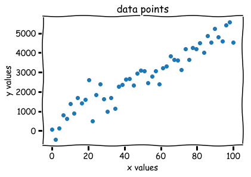
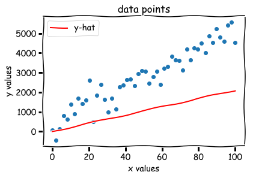
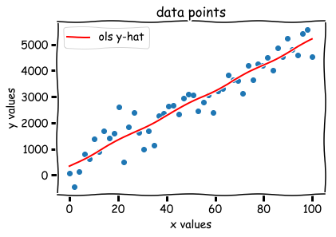
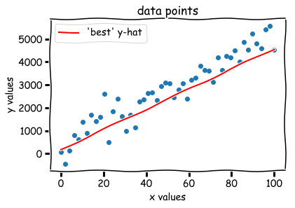
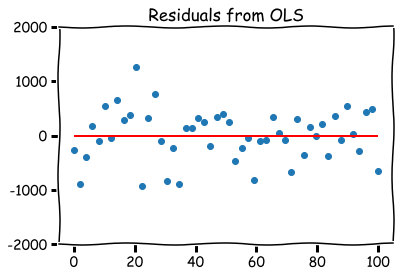
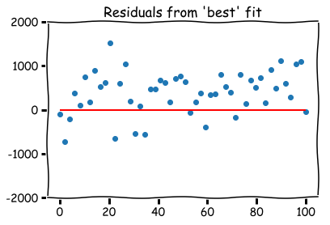
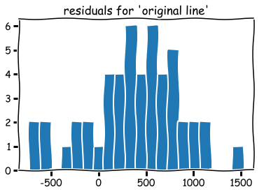
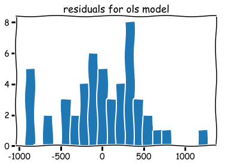

### Questions
* Heteroskedacicity - sp?
* Why is it important that data is normal?
* Q plots 

### Objectives
YWBAT
* define linear regression
    * finding the best line that fits the data points in our sample
    * taking the distances between the points and lines...calculating an r2 score
    * finding a line with the least amount of error
    * independent and dependent variables
    * taking a subset of data and mapping it/plotting it to uncover the parameters (slope and intercept) to use in the equation to predict yvalues
* create an example of linear regression
* describe what the various parts do in regards to the linreg equation
* calculate the error of a linear regression equation
* graph residuals and discuss heteroskedacicity

### What is linear regression?


### When do we use it?
* basic linear regression - almost never

### Let's make an example with some data!!!!!


```python
import numpy as np
import matplotlib.pyplot as plt
import seaborn as sns
plt.xkcd()
```


    <contextlib._GeneratorContextManager at 0x10e6aed30>


```python
# 50 values between 0 and 100 including 0 and 100
x_vals = np.linspace(0, 100, 50)
```


```python
x_vals
```


    array([  0.        ,   2.04081633,   4.08163265,   6.12244898,
             8.16326531,  10.20408163,  12.24489796,  14.28571429,
            16.32653061,  18.36734694,  20.40816327,  22.44897959,
            24.48979592,  26.53061224,  28.57142857,  30.6122449 ,
            32.65306122,  34.69387755,  36.73469388,  38.7755102 ,
            40.81632653,  42.85714286,  44.89795918,  46.93877551,
            48.97959184,  51.02040816,  53.06122449,  55.10204082,
            57.14285714,  59.18367347,  61.2244898 ,  63.26530612,
            65.30612245,  67.34693878,  69.3877551 ,  71.42857143,
            73.46938776,  75.51020408,  77.55102041,  79.59183673,
            81.63265306,  83.67346939,  85.71428571,  87.75510204,
            89.79591837,  91.83673469,  93.87755102,  95.91836735,
            97.95918367, 100.        ])


```python
# choosing a random integer between 20 and 50 for a slope
slope = np.random.randint(20, 50)


# generates normal distribution with mu=100 sigma=200 n_points=50
errors = np.random.normal(300, 500, 50)

# bias ~ intercept
# random integer between 20 and 200
bias = np.random.randint(20, 200)
```


```python
# 
y_vals = bias + slope*x_vals + errors
```


```python
plt.scatter(x_vals, y_vals)
plt.xlabel("x values")
plt.ylabel("y values")
plt.title("data points")
plt.show()
```





### Let's check the correlation coefficient


```python
np.corrcoef(x_vals, y_vals)
```


    array([[1.        , 0.95162211],
           [0.95162211, 1.        ]])


```python
### let's just guess a slope
slope_guess = 21
bias_guess = 0
```


```python
### this yields a y_hat array of
y_hat = bias_guess + slope_guess*x_vals
y_hat
```


    array([   0.        ,   42.85714286,   85.71428571,  128.57142857,
            171.42857143,  214.28571429,  257.14285714,  300.        ,
            342.85714286,  385.71428571,  428.57142857,  471.42857143,
            514.28571429,  557.14285714,  600.        ,  642.85714286,
            685.71428571,  728.57142857,  771.42857143,  814.28571429,
            857.14285714,  900.        ,  942.85714286,  985.71428571,
           1028.57142857, 1071.42857143, 1114.28571429, 1157.14285714,
           1200.        , 1242.85714286, 1285.71428571, 1328.57142857,
           1371.42857143, 1414.28571429, 1457.14285714, 1500.        ,
           1542.85714286, 1585.71428571, 1628.57142857, 1671.42857143,
           1714.28571429, 1757.14285714, 1800.        , 1842.85714286,
           1885.71428571, 1928.57142857, 1971.42857143, 2014.28571429,
           2057.14285714, 2100.        ])


```python
plt.scatter(x_vals, y_vals)
plt.plot(x_vals, y_hat, c='r', label='y-hat')
plt.xlabel("x values")
plt.ylabel("y values")
plt.title("data points")
plt.legend()
plt.show()
```





### RMSE equation


```python
### Yikes! How bad is this?

### Let's create our RMSE equations

def RMSE(y_true, y_pred):
    num = np.sum((y_true - y_pred)**2)
    den = np.sum((y_true - y_true.mean())**2)
    return 1.0 - 1.0 * num / den

def RMSE2(y_true, y_pred):
    num = np.sum((y_pred - y_true.mean())**2)
    den = np.sum((y_true - y_true.mean())**2)
    return 1.0 * num / den
```


```python
RMSE(y_vals, y_hat)
```


    -0.6941483172058285


```python
RMSE2(y_vals, y_hat)
```


    1.4789890159256247


### which one will python use? Let's import from sklearn.metrics


```python
from sklearn.metrics import r2_score
```


```python
r2_score(y_vals, y_hat)
```


    -0.6941483172058285


### now, how can we do this using statsmodels?


```python
import statsmodels.api as sm # very standard
```


```python
x_vals
```


    array([  0.        ,   2.04081633,   4.08163265,   6.12244898,
             8.16326531,  10.20408163,  12.24489796,  14.28571429,
            16.32653061,  18.36734694,  20.40816327,  22.44897959,
            24.48979592,  26.53061224,  28.57142857,  30.6122449 ,
            32.65306122,  34.69387755,  36.73469388,  38.7755102 ,
            40.81632653,  42.85714286,  44.89795918,  46.93877551,
            48.97959184,  51.02040816,  53.06122449,  55.10204082,
            57.14285714,  59.18367347,  61.2244898 ,  63.26530612,
            65.30612245,  67.34693878,  69.3877551 ,  71.42857143,
            73.46938776,  75.51020408,  77.55102041,  79.59183673,
            81.63265306,  83.67346939,  85.71428571,  87.75510204,
            89.79591837,  91.83673469,  93.87755102,  95.91836735,
            97.95918367, 100.        ])


```python
x = sm.add_constant(x_vals)
```


```python
x
```


    array([[  1.        ,   0.        ],
           [  1.        ,   2.04081633],
           [  1.        ,   4.08163265],
           [  1.        ,   6.12244898],
           [  1.        ,   8.16326531],
           [  1.        ,  10.20408163],
           [  1.        ,  12.24489796],
           [  1.        ,  14.28571429],
           [  1.        ,  16.32653061],
           [  1.        ,  18.36734694],
           [  1.        ,  20.40816327],
           [  1.        ,  22.44897959],
           [  1.        ,  24.48979592],
           [  1.        ,  26.53061224],
           [  1.        ,  28.57142857],
           [  1.        ,  30.6122449 ],
           [  1.        ,  32.65306122],
           [  1.        ,  34.69387755],
           [  1.        ,  36.73469388],
           [  1.        ,  38.7755102 ],
           [  1.        ,  40.81632653],
           [  1.        ,  42.85714286],
           [  1.        ,  44.89795918],
           [  1.        ,  46.93877551],
           [  1.        ,  48.97959184],
           [  1.        ,  51.02040816],
           [  1.        ,  53.06122449],
           [  1.        ,  55.10204082],
           [  1.        ,  57.14285714],
           [  1.        ,  59.18367347],
           [  1.        ,  61.2244898 ],
           [  1.        ,  63.26530612],
           [  1.        ,  65.30612245],
           [  1.        ,  67.34693878],
           [  1.        ,  69.3877551 ],
           [  1.        ,  71.42857143],
           [  1.        ,  73.46938776],
           [  1.        ,  75.51020408],
           [  1.        ,  77.55102041],
           [  1.        ,  79.59183673],
           [  1.        ,  81.63265306],
           [  1.        ,  83.67346939],
           [  1.        ,  85.71428571],
           [  1.        ,  87.75510204],
           [  1.        ,  89.79591837],
           [  1.        ,  91.83673469],
           [  1.        ,  93.87755102],
           [  1.        ,  95.91836735],
           [  1.        ,  97.95918367],
           [  1.        , 100.        ]])


```python
linreg = sm.OLS(y_vals, x).fit()
```


```python
summary = linreg.summary()
summary
```


<table class="simpletable">
<caption>OLS Regression Results</caption>
<tr>
  <th>Dep. Variable:</th>            <td>y</td>        <th>  R-squared:         </th> <td>   0.906</td>
</tr>
<tr>
  <th>Model:</th>                   <td>OLS</td>       <th>  Adj. R-squared:    </th> <td>   0.904</td>
</tr>
<tr>
  <th>Method:</th>             <td>Least Squares</td>  <th>  F-statistic:       </th> <td>   460.4</td>
</tr>
<tr>
  <th>Date:</th>             <td>Wed, 08 May 2019</td> <th>  Prob (F-statistic):</th> <td>3.02e-26</td>
</tr>
<tr>
  <th>Time:</th>                 <td>11:37:52</td>     <th>  Log-Likelihood:    </th> <td> -377.60</td>
</tr>
<tr>
  <th>No. Observations:</th>      <td>    50</td>      <th>  AIC:               </th> <td>   759.2</td>
</tr>
<tr>
  <th>Df Residuals:</th>          <td>    48</td>      <th>  BIC:               </th> <td>   763.0</td>
</tr>
<tr>
  <th>Df Model:</th>              <td>     1</td>      <th>                     </th>     <td> </td>   
</tr>
<tr>
  <th>Covariance Type:</th>      <td>nonrobust</td>    <th>                     </th>     <td> </td>   
</tr>
</table>
<table class="simpletable">
<tr>
    <td></td>       <th>coef</th>     <th>std err</th>      <th>t</th>      <th>P>|t|</th>  <th>[0.025</th>    <th>0.975]</th>  
</tr>
<tr>
  <th>const</th> <td>  342.8118</td> <td>  131.062</td> <td>    2.616</td> <td> 0.012</td> <td>   79.294</td> <td>  606.330</td>
</tr>
<tr>
  <th>x1</th>    <td>   48.4615</td> <td>    2.259</td> <td>   21.457</td> <td> 0.000</td> <td>   43.920</td> <td>   53.003</td>
</tr>
</table>
<table class="simpletable">
<tr>
  <th>Omnibus:</th>       <td> 0.449</td> <th>  Durbin-Watson:     </th> <td>   2.000</td>
</tr>
<tr>
  <th>Prob(Omnibus):</th> <td> 0.799</td> <th>  Jarque-Bera (JB):  </th> <td>   0.137</td>
</tr>
<tr>
  <th>Skew:</th>          <td>-0.123</td> <th>  Prob(JB):          </th> <td>   0.934</td>
</tr>
<tr>
  <th>Kurtosis:</th>      <td> 3.075</td> <th>  Cond. No.          </th> <td>    114.</td>
</tr>
</table>


### Let's interpret this!
* R-squared - 91% of the variablility of y is explained by x
* const: - 342.8118 - y-intercept - pvalue=0.012 this is probably not random
* x1: coeff - 48.4615 - slope - pvalue=0.000 this is not random
* skewedness: -0.123 - symmetrical
* kurtosis: 3.075 - data is centered on the mean 


```python
# how close were we?
slope, bias
```


    (44, 177)


```python
linreg.params
```


    array([342.81183419,  48.46149695])


```python
ols_bias, ols_slope = linreg.params
ols_y_hat = ols_bias + ols_slope*x_vals
ols_slope, ols_bias
```


    (48.461496947652016, 342.81183418825196)


```python
plt.scatter(x_vals, y_vals)
plt.plot(x_vals, ols_y_hat, c='r', label='ols y-hat')
plt.xlabel("x values")
plt.ylabel("y values")
plt.title("data points")
plt.legend()
plt.show()
```





```python
best_y_hat = bias + slope*x_vals
```


```python
plt.scatter(x_vals, y_vals)
plt.plot(x_vals, best_y_hat, c='r', label="'best' y-hat")
plt.xlabel("x values")
plt.ylabel("y values")
plt.title("data points")
plt.legend()
plt.show()
```





```python
r2_score(y_vals, ols_y_hat), r2_score(y_vals, best_y_hat)
```


    (0.9055846458429161, 0.8306753641399622)


```python
residuals_ols = y_vals - ols_y_hat
residuals_best = y_vals - best_y_hat
```


```python
plt.scatter(x_vals, residuals_ols)
plt.title("Residuals from OLS")
plt.hlines(xmin=0, xmax=100, color='r', y=0)
plt.ylim([-2000, 2000])
plt.show()

plt.scatter(x_vals, residuals_best)
plt.title("Residuals from 'best' fit")
plt.hlines(xmin=0, xmax=100, color='r', y=0)
plt.ylim([-2000, 2000])
plt.show()
```








```python
plt.hist(residuals_best, bins=20)
plt.title("residuals for 'original line'")
plt.show()

plt.hist(residuals_ols, bins=20)
plt.title("residuals for ols model")
plt.show()
```








### what did we learn?
* a better understanding of distributions - fitting within the 3 lines on the graph
    * uniform distribution of residuals
* best practices for estimating our line of best fit
    * check the residuals
    * use rmse equations (r2_score)
* using statsmodels
* graphing residuals as a line plot is more beneficial vs a histogram to determine the best fit
* ols picks the best fit line and minimizes the distances
* statsmodels can be used with both formula and without it
